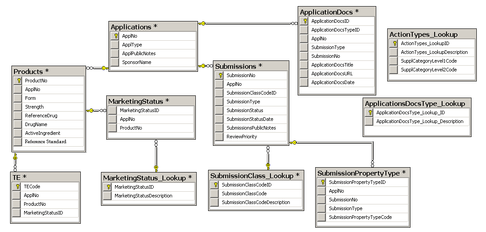

# Parse FDA drugs

A quick script to download the [Drugs@FDA](https://www.fda.gov/Drugs/InformationOnDrugs/ucm079750.htm) data into a Postgres database.



## To run
```
pip install -r requirements.txt
./run.sh
```

**NOTE:** 

- the `Products.txt` table has extra trailing tabs in lines 34517-24519 which were manually removed so that `insert.py` could run properly.
- all table names and table attributes are formatted with underscores and lowercase; for example the table name `ApplicationDocs` is created as `application_docs`.
- the archive [fda_drugs_2018-04-09.zip](fda_drugs_2018-04-09.zip) is provided as a refernce for a set of data that currently works with this repo.
